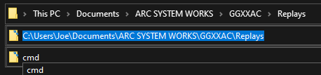

# Using OrganizeReplaysMetaData.py

## Python

You’ll need to have python installed to run a python script, you can find various versions from the following link. https://www.python.org/downloads/

I believe I’m personally using 3.9, but any version 3.7 or newer should work fine.

## Running the Script

Download the script and place it in a folder, I personally placed it in my replays folder. If your .py files are set to launch with python, you should be able to double click on the script to run it.

Alternatively, you can run it on the command line. You’ll need to navigate the command prompt to the directory you placed the script in, the easiest way to accomplish this is to left click on the file path in file explorer, and type in `cmd`, then click enter as shown below.



This should open a command prompt that looks something like this. From there, you should be able to enter in the script name as displayed below. You can use the tab key to autofill in the name.

```
Microsoft Windows [Version 10.0.19043.1466]
(c) Microsoft Corporation. All rights reserved.
C:\Users\Joe\Documents\ARC SYSTEM WORKS\GGXXAC\Replays>
C:\Users\Joe\Documents\ARC SYSTEM WORKS\GGXXAC\Replays>OrganizeReplaysMetaData.py
```

After the script is running for the first time, you should see a dialogue box like this.

```
Config file not found, creating config file.
running first time set up, enter in your steam username:
```

It’ll create a ‘replayOrganizerConfig.ini’ file in that same directory. It’s prompting you for your steam username so it can associate that with your steam id, so that it won’t have to prompt you for your username again, and won’t mess up organization if you change it.

```
could not find username in replay files.
please either enter in your SteamID manually here, or ensure you entered your username properly and try again.
```

If this text pops up after entering your username, it wasn’t able to locate a match with the username you provided. Make sure you entered your username correctly, and that there are replay files with that username in your replay folder. Alternatively, you can manually enter your steam id when you see this prompt.

Assuming it can find your username, the script should run without issue at this point. It may take a while if you have thousands of replays to sort through, but you should be able to see progress in the replay folder itself. If you run into issues with the script at this point, refer to the ‘known issues’ section at the end of this document, or feel free to contact me directly.

```
Config file not found, creating config file.
running first time set up, enter in your steam username: Joefish
Organization Complete!
```

## replayOrganizerConfig.ini

This file is used to associate player’s steam id with a nickname so that it can sort all matches with that player into the same folder regardless of whether or not they change their username. You can also manually change this nickname within the config file if you want to, it tends to grab the oldest name in your replays unfortunately. Just open the config file in a text editor, and search for the nickname you want to choose.

For example, I can replace `(steamid)=DragonslayerHonnou` with `(steamid)=Honnou`

Be sure not to include additional whitespace.

Now, any new replay files will be placed into a folder with that new nickname. To move old replays over, I’d suggest moving them manually and deleting the old folder for small adjustments to the config file.

I’ve also included an optional parameter for the script that’ll move **all files** within the replay folder directory to the root (replay) folder, and **delete** all subfolders. This can be useful if you change a lot of nicknames and don’t feel like moving those files around manually. Again, just note that the organizer may take a while when moving around thousands of replays.

```
C:\Users\Joe\Documents\ARC SYSTEM WORKS\GGXXAC\Replays>OrganizeReplaysMetaData.py reformat

C:\Users\Joe\Documents\ARC SYSTEM WORKS\GGXXAC\Replays>OrganizeReplaysMetaData.py
Organization Complete!
```

After using this reformat option, you can run the script with no additional parameters to organize all the replays again with the new nicknames. Additionally, I wanted to mention that you can give several individuals the same nickname if you feel like that third layer of organization has too many folders.

## Editing the Script

Part of what’s nice about this being a python script is that it’s relatively easy to modify to suit your individual needs if you have the know-how. I figured I’d take a brief rundown of various parts of the script, and general tips for modifying the script.

```py
#label:[file_offset,num_type]
metadata_dictionary = {
"year":[0x1a,16], "month":[0x1c,8], "day":[0x1d,8], "hour":[0x1e,8], "minute":[0x1f,8], "second":[0x20,8], "p1 steam id":[0x22,64], "p2 steam id":[0x2a,64], 
"p1 name":[0x32,'c'], "p2 name":[0x52,'c'], "p1 char":[0x72,8], "p2 char":[0x73,8], "ex chars?":[0x74,8], "single or team":[0x75,8], "+R or AC":[0x76,8],
"recording location timezone bias against GMT":[0x77,32], "p1 rounds":[0x7B,8], "p2 rounds":[0x7C,8], "unfinished match, disconnect, desync bitmask":[0x7D,8],
"ping":[0x7E,8], "match duration in frames":[0x7F,32], "p1 score":[0x83,8], "p2 score":[0x84,8], "p1 rank":[0x85,8], "p2 rank":[0x86,8], "winner side":[0x87,8]
}

# (1-25, SO KY MA MI AX PO CH ED BA FA TE JA AN JO VE DI SL IN ZA BR RO AB OS KL JU)
character_array = ['Sol', 'Ky', 'May', 'Millia', 'Axl', 'Potemkin', 'Chipp', 'Eddie', 'Baiken', 'Faust', 'Testament', 'Jam', 'Anji', 'Johnny', 'Venom', 'Dizzy',
 				   'Slayer', 'I-No', 'Zappa', 'Bridget', 'Robo-Ky', 'Aba', 'Order Sol', 'Kliff', 'Justice']
```

The metadata dictionary contains all metadata labels coupled with their file offset and num type. The character array is used to translate the p1/p2 char data from an integer into a character’s name. The order of the character array matches the order found within the metadata, but is indexed at 0-24 while the metadata is 1-25.

`ParseMetaData()` will return a dictionary with a given replay file’s metadata parsed into a readable format.

I created `PartialParseMetaData()` because I didn’t need all of it, and it saves a bit of time during execution. I’d recommend looking into how it grabs specific labels instead of all of them if you end up wanting to do something similar.

```py
replay_files = os.listdir(file_path) #get a list of replay files
for file in replay_files:
	if 'ggr' in file.lower(): #ensure its a replay file
		metaData = PartialParseMetadata(file_path+"\\"+file)
		#determine if the user was p1/p2, or a spectator.------------------------------------------------------------------------
		player, opponent = DeterminePlayerSide(metaData)

		if player == '': #if it was a spectated match, move it into spectated matches.-------------------------------------------
			spectate_path = file_path+"\\Spectated Matches"
			CreatePath(spectate_path)
			MoveFile(spectate_path,file)
		else:
			#determine if the opponent is in the config_dictionary, add them if they aren't--------------------------------------
			if not CheckConfDict(config_dictionary,str(metaData[opponent+' steam id'])):
				opName = metaData[opponent+' name']
				invalid = '<>:"/\\|?*. '
				for char in invalid: #need to remove illegal characters for folder names.
					opName = opName.replace(char, '')
				if opName == "":
					opName = 'blank'
				config_dictionary[str(metaData[opponent+' steam id'])] = opName

			#organization--------------------------------------------------------------------------------------------------------
			temp_path = file_path+"\\"+"As "+metaData[player+' char']+'\\'+"Against "+metaData[opponent+' char']+'\\'+"Against "+config_dictionary[str(metaData[opponent+' steam id'])]
			CreatePath(temp_path)
			MoveFile(temp_path,file)

			#write config_dictionary to the config file--------------------------------------------------------------------------
			with open('replayOrganizerConfig.ini', 'w', encoding="utf-8") as file:
				for steamID in config_dictionary:
					file.write(str(steamID)+"="+config_dictionary[steamID]+"\n")
```

This is probably the most relevant section to modify. `player` and `opponent` are assigned the string `"p1"` or `"p2"` based on which side the user was on, if it was a spectated match, both are assigned `""`. This essentially removes the need to check player side later, which would otherwise require an excessive amount of if statements and near identical code blocks. 

The `if not CheckConfDict` block will add users to the config file if they do not have an entry already. There’s a lot of additional checks names need to be ran through to ensure there aren’t any illegal characters, and that it isn’t blank (shout out to whoever named themselves ‘.’).

Finally, the gigantic `temp_path` line is what actually determines the folder structure that it’ll move files into, the `"\\"` characters indicate a folder layer, and the strings in-between them represent what those folders will be named.

## Known Issues

### File Path

```py
# Ensure this filepath is correct.
file_path = 'C:\\Users\\' + os.getlogin() + '\\Documents\\ARC SYSTEM WORKS\\GGXXAC\\Replays'
```

If you’re getting file not found errors, you may need to adjust this file path within the script to correct it. This has occurred for users utilizing OneDrive as it’ll store your replays in there, something like + `\\OneDrive\\Documents`… might work in that situation, additionally, if your replays are stored on a different drive, you’ll need to edit that as well.

### Permission Error

Unfortunately I’ve only seen this error once and I was unable to resolve it, if you encounter a permission error, please let me know and I’ll try to help you with it. This user in particular was having permission errors with OneDrive that created bizarre results with the legacy script where it wouldn’t even error out, but it wouldn’t reach various print statements either.
